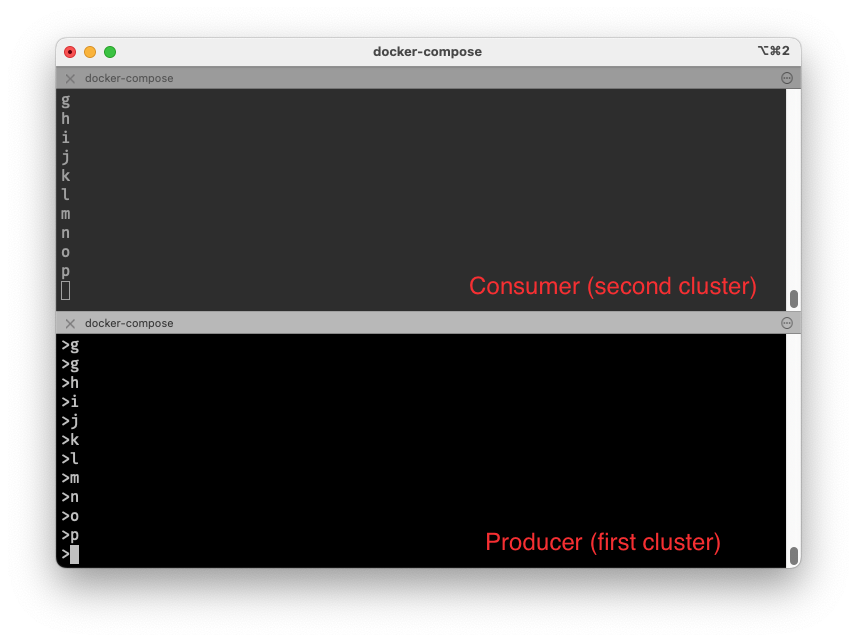

# Confluent Platform Cluster Linking 

A project to demonstrate Cluster Linking Between two clusters running Confluent Platform (7.3.1).

The project will set up two 3-broker Kafka Clusters, each with a separate Zookeeper instance.

## Starting the Clusters

Start both clusters using the provided `docker-compose.yaml` file:

```bash
docker-compose up
```

If everything has run successfully, you should see 6 Brokers and 2 Zookeeper instances in the output to `docker ps`:

```
CONTAINER ID   IMAGE                             COMMAND                  CREATED        STATUS        PORTS                                                        NAMES
1ab2925ae4d5   confluentinc/cp-server:7.3.1      "/etc/confluent/dock…"   13 hours ago   Up 13 hours   0.0.0.0:9096->9096/tcp, 9092/tcp, 0.0.0.0:29096->29096/tcp   broker6
6c20fad4ae81   confluentinc/cp-server:7.3.1      "/etc/confluent/dock…"   13 hours ago   Up 13 hours   0.0.0.0:9091->9091/tcp, 0.0.0.0:29091->29091/tcp, 9092/tcp   broker1
2143cf399f74   confluentinc/cp-server:7.3.1      "/etc/confluent/dock…"   13 hours ago   Up 13 hours   0.0.0.0:9092->9092/tcp, 0.0.0.0:29092->29092/tcp             broker2
091b97e31b3b   confluentinc/cp-server:7.3.1      "/etc/confluent/dock…"   13 hours ago   Up 13 hours   0.0.0.0:9094->9094/tcp, 9092/tcp, 0.0.0.0:29094->29094/tcp   broker4
bbbc139dc710   confluentinc/cp-server:7.3.1      "/etc/confluent/dock…"   13 hours ago   Up 13 hours   0.0.0.0:9093->9093/tcp, 9092/tcp, 0.0.0.0:29093->29093/tcp   broker3
7401437afae7   confluentinc/cp-zookeeper:7.3.1   "/etc/confluent/dock…"   13 hours ago   Up 13 hours   2181/tcp, 2888/tcp, 3888/tcp                                 zookeeper
2a7b836bc370   confluentinc/cp-server:7.3.1      "/etc/confluent/dock…"   13 hours ago   Up 13 hours   0.0.0.0:9095->9095/tcp, 9092/tcp, 0.0.0.0:29095->29095/tcp   broker5
094e477623e4   confluentinc/cp-zookeeper:7.3.1   "/etc/confluent/dock…"   13 hours ago   Up 13 hours   2181/tcp, 2888/tcp, 3888/tcp                                 zookeeper2
```

## Ensuring everything is working and has started correctly

### Checking the first cluster

We can quickly check the status of each cluster using `zookeeper-shell` on the first cluster:

```bash
docker-compose exec zookeeper zookeeper-shell localhost:2181
```

```
ls /
[admin, brokers, cluster, config, consumers, controller, controller_epoch, feature, isr_change_notification, latest_producer_id_block, leadership_priority, log_dir_event_notification, zookeeper]
```

```
get /controller
{"version":1,"brokerid":2,"timestamp":"1673382716473"}
```

```
get /cluster/id
{"version":"1","id":"YTAd13fGSziks7O0NRs2QA"}
```

```
ls /brokers/ids
[1, 2, 3]
```

```
get /brokers/ids/1
{"features":{},"listener_security_protocol_map":{"BROKER":"PLAINTEXT","PLAINTEXT_HOST":"PLAINTEXT"},"endpoints":["BROKER://broker1:9091","PLAINTEXT_HOST://localhost:29091"],"jmx_port":-1,"port":9091,"host":"broker1","version":5,"tags":{},"timestamp":"1673382717473"}
```

### Checking the second cluster

Now let's try to connect to Zookeeper instance on the second cluster using `zookeeper-shell`:

```bash
docker-compose exec zookeeper2 zookeeper-shell localhost:2182
```

```
ls /
[admin, brokers, cluster, config, consumers, controller, controller_epoch, feature, isr_change_notification, latest_producer_id_block, leadership_priority, log_dir_event_notification, zookeeper]
```

```
get /controller
{"version":1,"brokerid":3,"timestamp":"1673382712259"}
```

```
get /cluster/id
{"version":"1","id":"3vcAUrrvSCqPDykFsSIhfg"}
```

```
ls /brokers/ids
[1, 2, 3]
```

```
get /brokers/ids/1
{"features":{},"listener_security_protocol_map":{"BROKER":"PLAINTEXT","PLAINTEXT_HOST":"PLAINTEXT"},"endpoints":["BROKER://broker4:9094","PLAINTEXT_HOST://localhost:29094"],"jmx_port":-1,"port":9094,"host":"broker4","version":5,"tags":{},"timestamp":"1673382714368"}
```

## Get the IDs for both clusters

While this information was exposed by `zookeeper-shell`, this can also be done by issuing the `kafka-cluster cluster-id` command against broker1 (of the first cluster) and broker4 (of the second cluster).

Let's start with broker1 (the first cluster):

```bash
docker-compose exec broker1 kafka-cluster cluster-id --bootstrap-server broker1:9091
```

You should see something like:

```
Cluster ID: YTAd13fGSziks7O0NRs2QA
```

We will perform the same test with broker4 (the second cluster):

```bash
docker-compose exec broker4 kafka-cluster cluster-id --bootstrap-server broker4:9094
```

You should see:

```
Cluster ID: 3vcAUrrvSCqPDykFsSIhfg
```

## Establish the Cluster Link between both clusters

Create a file called `link-config.properties` containing the following properties (note that this file is also in the repository for reference):

```
bootstrap.servers=broker1:9091,broker2:9092,broker3:9093
sasl.mechanism=PLAIN
```

Copy the `link-config.properties` to broker1:

```bash
docker cp ./link-config.properties broker1:/tmp
```

Create the Cluster Link from `broker1` (the first cluster) and pass in the `cluster-id` of the first cluster, specifying the `bootstrap-server` of the second cluster:

```bash
docker-compose exec broker1 kafka-cluster-links --bootstrap-server broker4:9094 --create --link ab-link --config-file /tmp/link-config.properties --cluster-id YTAd13fGSziks7O0NRs2QA
```

``` 
Cluster link 'ab-link' creation successfully completed.
```

Now the link has been established, we can test to ensure everything looks okay.

## Confirm that the Cluster Link is working as expected

You can run `kafka-cluster-links` and pass in the `--list` parameter to get a list of available Cluster Links:

```bash
docker-compose exec broker1 kafka-cluster-links --list --bootstrap-server broker4:9094 
```

You will see output similar to this:

```
Link name: 'ab-link', link ID: 'XFdTSdXuTN6jULmLNrAuzQ', remote cluster ID: 'YTAd13fGSziks7O0NRs2QA', local cluster ID: '3vcAUrrvSCqPDykFsSIhfg', remote cluster available: 'true'
```

```bash
docker-compose exec broker1 kafka-configs --bootstrap-server broker4:9094 \
                  --describe \
                  --cluster-link ab-link
```

You will see:

```
Dynamic configs for cluster-link ab-link are:
  sasl.oauthbearer.token.endpoint.url=null sensitive=false synonyms={}
```

## Create a topic on the Source cluster and establish a mirror topic on the destination

Let's start by creating a topic on the source:

```bash
docker exec -it broker1 /bin/bash -c 'kafka-topics --bootstrap-server broker1:9091 --topic demo-perf-topic --replication-factor 3 --partitions 1 --create --config min.insync.replicas=2'
```

You should see:

```
Created topic demo-perf-topic.
```

Now let's establish the mirror of the topic on the destination cluster using the `kafka-mirrors` comand:

```bash
docker-compose exec broker1 kafka-mirrors --create --mirror-topic demo-perf-topic \
--link ab-link \
--bootstrap-server broker4:9094
```

You should see:

```
Created topic demo-perf-topic.
```

## Produce to the first cluster; Consume from the mirror on the second cluster

We are going to start a `kafka-console-producer` on the first cluster to create some messages:

```bash
docker-compose exec broker1 kafka-console-producer --bootstrap-server broker1:9091 --topic demo-perf-topic
```

In a separate terminal tab, let's start a consumer on the second cluster

Create a properties file `consumer.properties` or use the one in the repository:

```properties
sasl.mechanism=PLAIN
```

Copy the properties file over to `broker4`:

```bash
docker cp ./consumer.properties broker4:/tmp
```

Then run `kafka-console-consumer` on broker4 and specify the mirror topic:

```bash
docker-compose exec broker4 kafka-console-consumer --bootstrap-server broker4:9094 --consumer.config /tmp/consumer.properties --from-beginning --topic demo-perf-topic
```

Confirm that any messages produced to the first cluster can be read from the consumer running against the mirror topic:



## Further Reading

- https://docs.confluent.io/platform/current/multi-dc-deployments/cluster-linking/migrate-cp.html
- https://docs.confluent.io/cloud/current/multi-cloud/cluster-linking/index.html#share-data-with-cluster-linking-on-ccloud
- https://docs.confluent.io/platform/current/multi-dc-deployments/cluster-linking/mirror-topics-cp.html#mirror-topics-for-cluster-linking